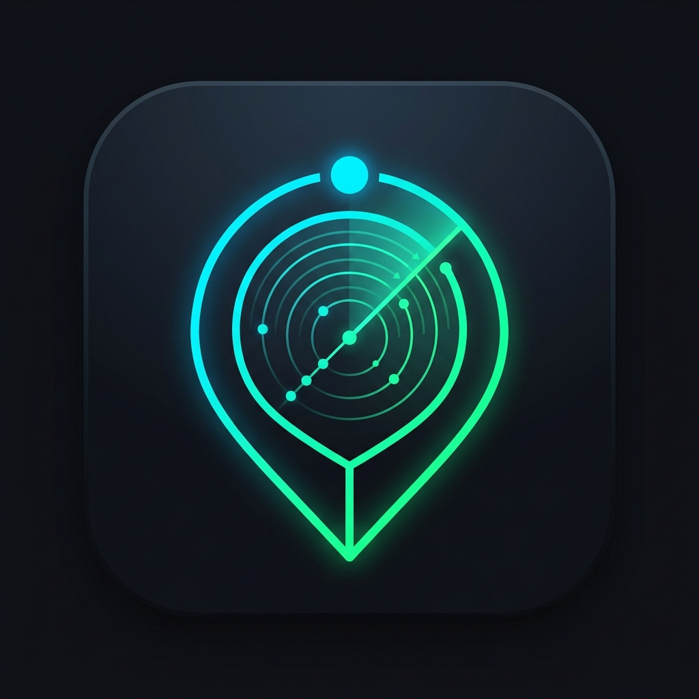

<div align="center">
  
  
  # BizRadar (formerly LeadForge AI)
  **The Ultimate Open-Source Business Intelligence & Lead Generation Engine**

  <p>
    Built for modern B2B SaaS teams, marketing agencies, and growth hackers. BizRadar turns local geographic searches into highly enriched, actionable lead pipelines in seconds—at absolutely <b>zero API cost</b>.
  </p>
</div>

---

## 🚀 Why BizRadar?

Traditional lead generation platforms charge hundreds of dollars for stale, outdated databases, or force you to pay per-API-request just to get a business's email address. 

**BizRadar flips the script.** 
By leveraging a powerful, self-hosted headless browser scraper, BizRadar pulls live, real-time data directly from Google Maps and intelligently crawls company websites to extract contact information.

- **Stop paying for leads:** Our integrated `gosom` headless scraper acts as your free, unlimited data provider.
- **Deep Enrichment:** We don't just find names. We extract Emails, LinkedIn profiles, Phone Numbers, and Google Ratings on the fly.
- **Premium User Experience:** A stunning, Glassmorphism-inspired UI built with Next.js 15, featuring Shimmer Loaders, smooth transitions, and real-time pagination.

---

## ✨ Features

- 🗺️ **Live Radar Discovery:** Search any keyword (e.g., "Dentists in London") and scrape up to 120 businesses instantly.
- 🕷️ **Intelligent Web Crawling:** Concurrently crawls discovered websites to hunt down hidden Emails and Social Links.
- 🎨 **Clearbit Enrichment:** Automatically resolves domains to fetch high-quality, pixel-perfect company logos.
- 💾 **CSV Exporting:** Download your entire pipeline of discovered leads into a clean, formatted CSV in a single click.
- 🔐 **Secure & Fast Auth:** Enterprise-grade authentication powered by Clerk.
- 🏗️ **Robust Architecture:** A heavily decoupled monorepo powered by NestJS (Backend) and Next.js (Frontend).

---

## 🛠 Tech Stack

BizRadar is built on a highly scalable, modern monorepo architecture:

### Frontend (Next.js 15)
- **Framework:** Next.js 15 (App Router, Server Components)
- **Styling:** Tailwind CSS, Framer Motion, Material Symbols
- **State Management:** React Hooks, Server Actions

### Backend (NestJS 10)
- **Framework:** NestJS 10 (Strict TypeScript, Modular Architecture)
- **Database:** PostgreSQL (Neon Serverless DB)
- **ORM:** Prisma
- **Data Engine:** Factory Pattern Discovery Module (Gosom Scraper / SerpApi Fallback)

### Infrastructure
- **Scraper:** Dockerized `gosom/google-maps-scraper` REST API
- **Authentication:** Clerk
- **Node:** v20+

---

## 🚦 Getting Started

### 1. Start the Headless Scraper
BizRadar requires the Gosom Google Maps Scraper to run in the background. Fire it up using Docker:
```bash
docker run -p 8081:8080 -d gosom/google-maps-scraper
```

### 2. Setup the Backend
Navigate to the API directory and configure your environment.
```bash
cd apps/api
npm install
# Set your DATABASE_URL, CLERK_SECRET_KEY, and GOSOM_API_URL in .env
npx prisma db push
npm run dev
```

### 3. Start the Frontend
In a new terminal, spin up the Next.js dashboard.
```bash
cd apps/web
npm install
npm run dev
```

Visit `http://localhost:3000` and watch your radar start sweeping for leads!

---

## 🔮 Roadmap

- [x] Integrate Dockerized headless scraper for unlimited free queries
- [x] Build multi-page UI pagination and Shimmer loaders
- [x] One-click CSV Exports
- [ ] Implement AI Command center for natural language queries
- [ ] Add WebSockets / SSE for live, incremental lead streaming 
- [ ] CRM integrations (HubSpot, Salesforce)

---

<div align="center">
  <b>Built with ❤️ for modern growth teams.</b>
</div>
